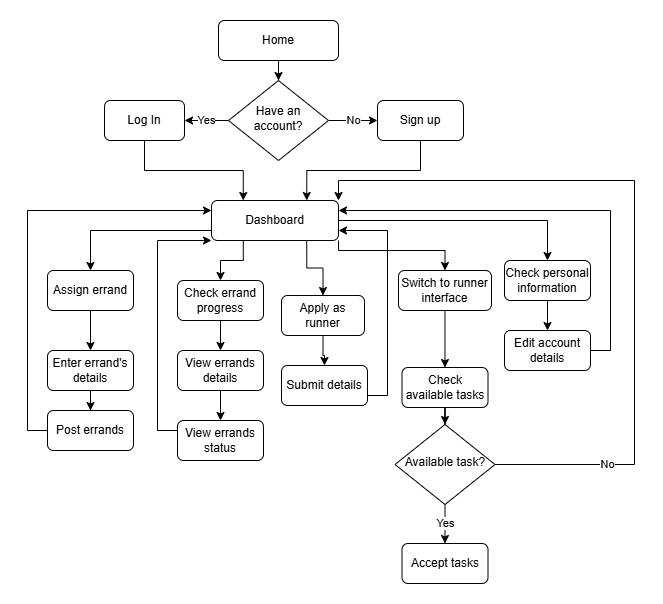

# INFO 4335 Section 1 Case Study
### Group Name: Omen<br>
### Group members:
  1. Mohamad Faris Aiman Bin Mohd Faizal 2111809
  2. Aiman Fathi Bin Mohd Fairuz 2121549 
  3. Engku Amirul Hakeem Bin Engku Mohamad Fadzrul 2121807

### Tasks List

| **Name**  | **Week 1 Tasks**                                                                                 | **Week 2 Tasks**                                                                                 |
|-----------|---------------------------------------------------------------------------------------------------|---------------------------------------------------------------------------------------------------|
| Faris | - Create GitHub repository <br> - Invite group members <br> - Create Project Gantt Chart <br> - Update Part 1 Report on Preferred Platform <br> - Update Part 1 Report on Features <br> - Check Weekly Progress Report <br> - Update References List <br> - Initialize i-run <br> - Initialize Firebase <br> - Errand database <br> - Student dashboard <br> - Student Assign Errand <br> - Runner Dashboard <br> - Available Task | - Update 2.1 Technical Feasibility & Back-end assessment <br> - Update References list <br> - Check Weekly Progress Report <br> - Check Full Case Study 1 Report | | Engku | - Accept GitHub repository invitation <br> - Update Part 1 Report on Target Audience <br> - Update Part 1 Report on Features: <br>       1. Manage tasks <br>       2. Integration with payment system <br>       3. User profiles <br> - Create Weekly Progress Report <br> - Update References List <br> - Runners Database <br> - Student Information Page <br> - Student Errand Progress <br> - Runner Application Page <br> - Runner Information Page | - Create 2.3 Sequence Diagram <br> - Update Weekly Progress Report <br> - Update References list <br> - Check Full Case Study 1 Report <br> - Peer Evaluation Form <br> - Submit case study repository URL and Weekly Progress Report | | Aiman | - Accept GitHub repository invitation <br> - Check Weekly Progress Report <br> - Update Part 1 Report on Preferred Platform <br> - Update Part 1 Report on Features: <br> - Check Weekly Progress Report <br> - Update References List <br> - Users Database <br> - Firebase Authentication <br> - Login <br> - Sign Up <br> - Runner Task Progress <br> - Runner Task History | - Update 2.2 App Compatibility <br> - Create 2.3 Navigation Flow Diagram <br> - Update References list <br> - Check Weekly Progress Report <br> - Check Full Case Study 1 Report <br> - Peer Evaluation Form <br> - Develop Login & Sign Up feature for the Runner App <br> - Develop Task Progress & Task History for the runner side |
---
### Purpose of Project
The Campus Errand Runner app is designed to simplify daily errands for IIUM students, by creating an apps that allow students to done tasks with the help of a runner. For tasks such as collecting parcels, buying itinerary or food supplies and sending item can be done easily by hiring a runner through this app. Other than helping with errands, this app also opens for students that are needing extra money to become a runner, without the need to put any deposits or complicated registration process.

### App Compatibality
The Campus Errand Runner apps is designed specifically for android devices currently.

---
### Target Audience
### 1. Errand Customers  
Errand customers are students who need tasks or errands completed but may not have the time or resources to do them themselves. These errands can range from simple tasks, like picking up documents from an office, to more specific requests, such as booking venues or purchasing items from nearby stores.  

**Key Characteristics:**  
- Busy with academic or personal commitments and need help managing daily errands.  
- May not have access to transportation or the ability to travel frequently around campus or nearby areas.  
- Require a simple, reliable, and affordable solution to delegate tasks efficiently.  
- Appreciate features like detailed task postings, secure payments, and real-time updates on task progress.  

**Example Use Cases:**  
1. A student needs help picking up an official letter from the Mahallah Office and delivering it to their dorm room.  
2. A student requests someone to book a venue at their Kulliyyah Office on their behalf due to overlapping commitments.  
3. A student needs items, such as snacks or toiletries, purchased and delivered from the Sri Gombak convenience store.  


### 2.Errand Runners  
Errand runners are students who take on tasks posted by errand customers. They aim to earn extra income, gain experience, or simply help their peers. The app acts as a platform to connect them with available jobs based on their preferences and availability.  

**Key Characteristics:**  
- Students who have flexible schedules and are looking for part-time opportunities or side income.  
- Tech-savvy individuals who can navigate the app efficiently to browse, filter, and accept tasks.  
- Motivated by convenience, proximity of tasks, and fair payment options.  
- May leverage the app to build a reputation through customer reviews, increasing their chances of securing more tasks.  

**Example Use Cases:**  
1. A student who has time between classes accepts tasks like printing documents for others at a nearby printing shop or campus facility.  
2. A student accepts tasks for booking venues or appointments at Kulliyyah Offices, especially for those unfamiliar with the process.  
3. A student with a car who often commutes to areas like Sri Gombak takes requests to buy and deliver items from convenience stores, offering reliable service for errands outside campus.
   
### Benefits for Both Groups  
- **Errand Customers:** Save time and effort while ensuring their tasks are completed quickly and securely.  
- **Errand Runners:** Gain a flexible source of income while providing value to the campus community.  
---
### Preferred platform
- As for preferred platform, we will be focusing on Android deployment first as Android has the biggest market share in Malaysia amounting to 71.56%.
---
## Features
### 1.Manage Tasks
- **Task Creation**: Customers input task details like description, location, due date, price, urgency, and requirements.  
  _Example:_ A KICT student books the Human Science venue before Friday.
- **Editing and Completion**: Customers can edit, cancel, or mark tasks as completed, with feedback.
- **Notifications**: Runners get real-time updates to accept/decline tasks. Customers are notified of status changes.
- **Progress Tracking**: Customers track task status (e.g., "in progress," "done"), and runners update progress.

### 2.Integration with Payment System
- **Cash/QR Payment**: Payments made in cash or via QR after task completion. Confirmation (photo/signature) triggers payment.
- **Online Payment**: Supports FPX and Touch 'n Go e-wallet. Runners are paid automatically and can withdraw to bank/e-wallet.
- **Transaction History**: Both customers and runners can view payment history for task-related disputes or resolution.

### 3.User Profiles with Reviews
- **Errand Customers**: Profiles include contact, preferences, past tasks, and matric card verification for legitimacy.
- **Errand Runners**: Profiles show skills, availability, payment options, and a profile picture to build trust.
- **Rating System**: After task completion, customers rate errand runners from 1 to 5 stars based on performance, reliability, and communication.
  
### 4.Notification for updates and deadlines of errands.
- **Customizable notification**: Runners can customize and set the kind of tasks and errands they prefer to perform and get notified whenever there is a errand related to their choosing.
- **Unclaimed task reminder**: Customers will receive timely reminders on their errands to ensure that errands that has not been completed or accepted by a runner, allowing them to cancel or reassign the task to ensure timely completion.

### 5.Premium feature for premium users
- **Priority task matching**: Priority queue features for premium users allow their errands to be picked up faster than normal ones.
- **Unlimited Errands**: Normal users are limited to a number of errands per month, with premium users are allowed to create unlimited number of tasks.

### 6. Login & Signup features
- **Matric Number Based Registration**: Students are asked to use their matric number and password as sign up and login credentials.
- **One account for all**: For both runner and students will be using the same signed up account, but with register as runner option later in the apps.

### 7. Runner Application
- **Register as runner**: Any students that wish to get extra money can register easily on the app by entering vehicle and license details.

### 8. Dashboard System
- **Dashboard Interface**: Dashboard contains all the features of the apps with simple interface that is easy to navigate.
- **Dashboard for Students & Runner**: Students can easily switch to Runner dashboard with the same dashboard layout but different features.
---
# Requirements Analysis
### Technical Feasibility and backend assessment
- The project will be utilizing the features provided by Firebase to complete requirements in our project.
### Registeration and login
- The project will utilize the authentication module which is provided in Firebase. Using these module, it will allow our application to be able to handle user registeration and login gracefully using Firebase authentication. The module also offers the ability to log in using other providers such as Microsoft and google email.
### Data storage operations
- As for the database operations, we will be utilizing the Firestore database module which is provided in Firebase. The module will be using NoSQL for the database operations.
### Analytics
- As for analyzing the usage and operations of the application, we will be utilizing the Analytics Dashboard.
### Packages and plugins
- As for the plugins and packages currently are the listed one that are essential
```txt
  firebase_core: ^3.6.0
  firebase_auth: ^5.3.2
  cloud_firestore: ^5.4.5
```
- The firebase_core and firebase_auth is eseential for providing connectivity to Firebase and providing authentication to users.
- cloud_firestore will be plugin responsible for CRUD operations connectivity.
  
---
### 
### Gantt Chart


---
### Sequence Diagram - Errand Customers

### Sequence Diagram - Errand Runners


---

### Navigational Flow Diagram


### Navigational Flow with Interface
- **Login Page** <br/>

- **Sign Up Page**<br/>

- **Student Dashboard Page** <br/>

- **Assign Errand Page** <br/>

- **Errand Progress Page** <br/>

- **Appply Runner Page**<br/>

- **Student Information Page**<br/>

- **Runner Dashboard Page**<br/>

- **Available Task Page**<br/>

- **Task Progress Page**<br/>

- **Task History Page**<br/>

- **Runner Information Page**<br/>


---
## References
1. Mobile Operating System market Share Malaysia | StatCounter Global Stats. (n.d.). StatCounter Global Stats. https://gs.statcounter.com/os-market-share/mobile/malaysia
2. GeeksforGeeks. (n.d.). Unified Modeling Language (UML) Sequence Diagrams. Retrieved from https://www.geeksforgeeks.org
3. OpenAI. (2024). ChatGPT model. Retrieved December 23, 2024, from https://chat.openai.com/
